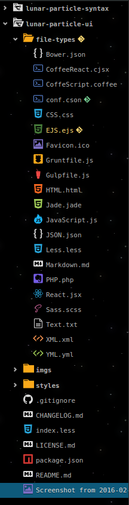
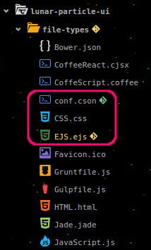
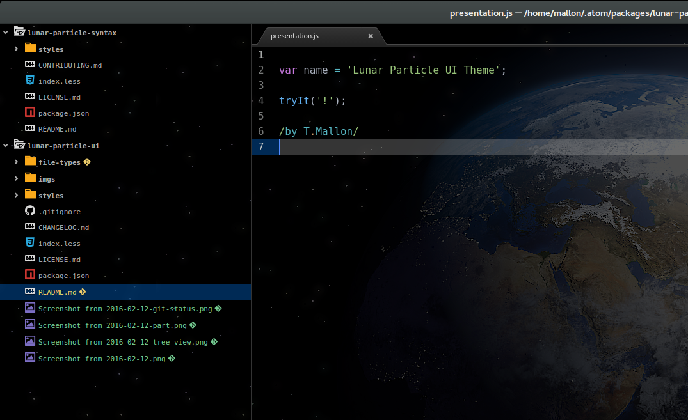
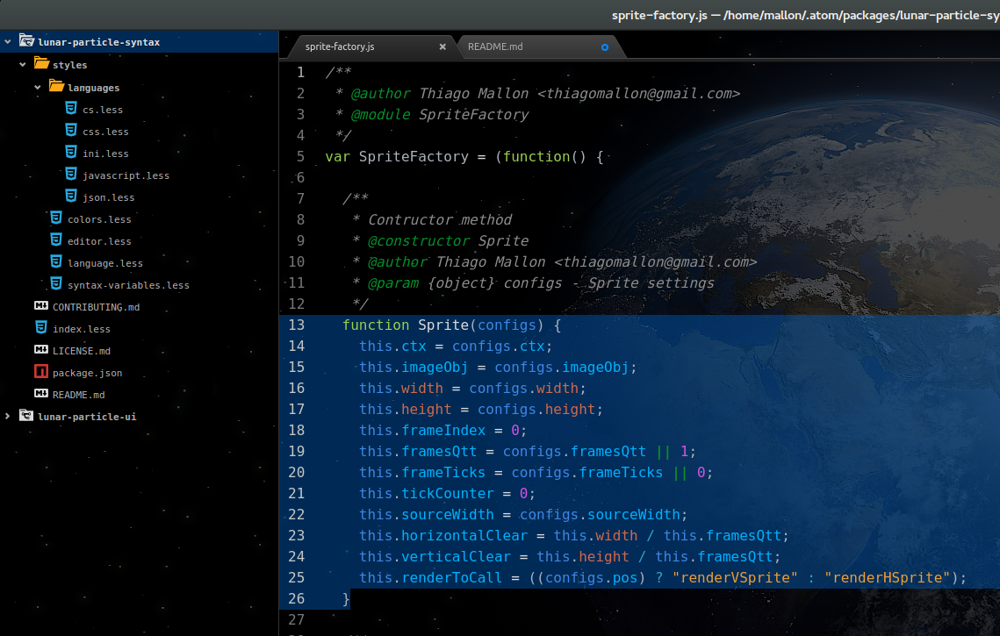
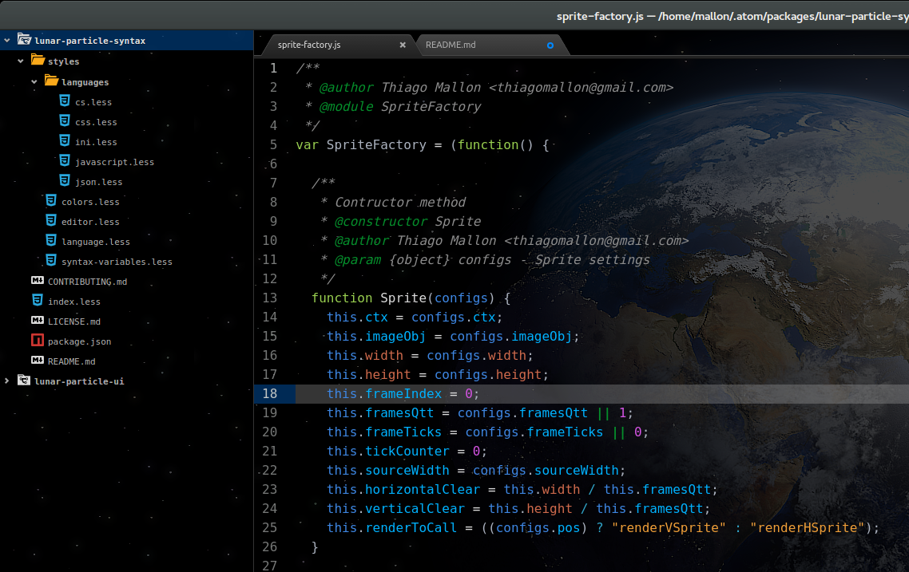
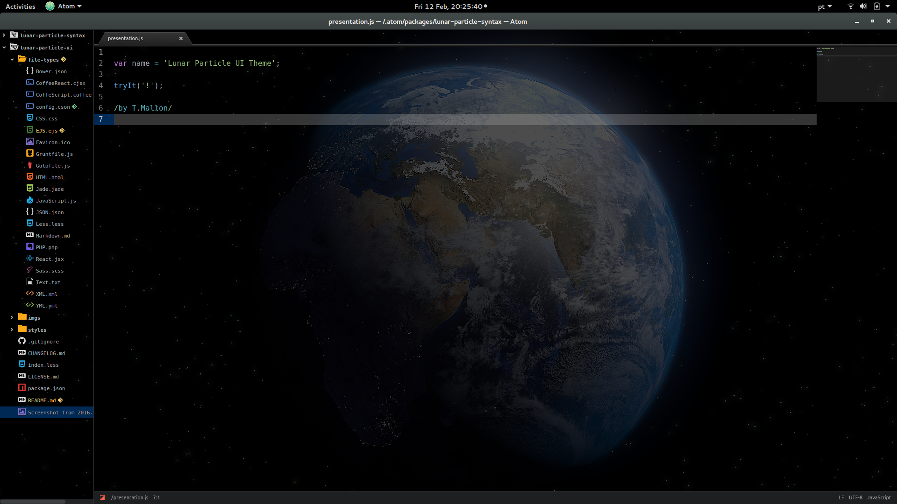

Lunar Particle UI Theme
=========
This is a dark theme with universe emphasize - now you will code with stars.

Description
----------------
This theme applies transparency to your editor's background to show an Earth photo behind your code.

**For a better experience use it with Lunar Particle Syntax**

Installation
------------

### By terminal:

* apm install lunar-particle-ui
* or search it from atom's settings console

Preview
-----------

**Singular Icons!**

**It puts an icon after changed/modified repository folders/files.**

**Awesome layout!**

**Different icons to collapsed/expanded folders and repo. folders.**

